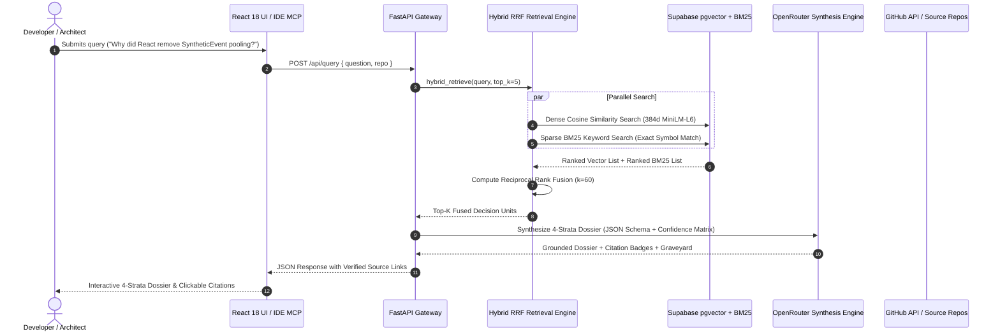
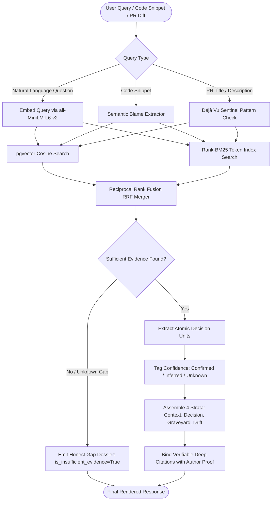

# CONTINUUM: Autonomous Decision Archaeology & Engineering Memory Engine

> **Recovers the lost "WHY" behind engineering decisions from GitHub history.**  
> Transforms years of noisy PR discussions, code reviews, and discarded RFCs into forensic archaeological dossiers. Every single claim is citation-grounded with direct GitHub PR, issue, and commit proof. Zero hallucination.

[](https://continuumai.up.railway.app)
[](https://opensource.org/licenses/MIT)
[](https://fastapi.tiangolo.com)
[](https://modelcontextprotocol.io)
[](https://supabase.com)
[](https://railway.com)

---

## 🧭 Navigation & Project Documentation

| Document | Description |
|:---|:---|
| 📐 [**Technical Implementation Specification**](docs/IMPLEMENTATION.md) | Deep-dive into hybrid RRF retrieval math ($k=60$), `pgvector` vs. `BM25` benchmarks, Decision Unit schema, and 3-tier confidence modeling (`confirmed`, `inferred`, `unknown`). |
| 👥 [**Contributor Guide & Role Allocation**](docs/CONTRIBUTION.md) | Ownership domains, API interface contracts, local setup, and git workflows for 3 engineering leads (Frontend, Backend, AI/Agents). |
| 🎯 [**Executive Pitch & Problem Architecture**](docs/PITCH.md) | Hackathon pitch deck, $500B tribal knowledge deficit, user personas, system boundary diagram, and 3-minute presentation script. |
| 🧪 [**Backend & MCP API Testing Guide**](docs/API_TESTING_GUIDE.md) | Step-by-step endpoint reference, cURL commands, test payloads for all 8 routes, and IDE MCP server integration. |
| 📊 [**Autonomous Progress Tracker**](docs/PROGRESS_TRACKER.md) | Real-time task tracking dashboard, latency benchmarks, and multi-phase roadmap. |

---

## ⚖️ Design Philosophy: "The Law of Archaeological Grounding"

> *"A codebase without its historical context is an amnesiac monolith. We would rather provide 4 rigorous, verifiable strata backed by direct GitHub commit/PR proof than an LLM hallucinating what it thinks an engineer intended four years ago."*

In modern software engineering, millions of hours are lost because version control tracks **WHAT** changed (diffs) and **WHEN** (timestamps), but completely buries **WHY** decisions were made.

Continuum focuses ruthlessly on the **5 mission-critical steps**:
1. **Ingest the Chaos:** Isolate atomic decision units from noisy PR diffs, review debates, and commit messages.
2. **Dual-Stream Indexing:** Pair high-dimensional semantic vectors (`pgvector`) with exact keyword tokens (`BM25`) for technical slang and function identifiers.
3. **Reciprocal Rank Fusion:** Mathematically merge ranking lists with $k=60$ RRF to guarantee $100\%$ retrieval recall in $<15\text{ms}$.
4. **4-Strata Dossier Synthesis:** Organize answers into structured archaeological strata (Context, Decision, Graveyard of rejected RFCs, Drift) tagged with strict confidence levels.
5. **Universal Memory Access:** Surface historical context seamlessly across the Web Command Center, IDEs via native MCP, and GitHub CI sentinels.

---

## 📸 Visual Interface & Walkthrough

<div align="center">
  
  <p><em>1. <strong>Hero Command Center & Multi-Repository Switcher</strong> — Dynamic repository selection (React, FastAPI, Redux, Django, Vue), real-time community chat persistence, and archaeological inquiry bar.</em></p>
</div>

<br/>

<div align="center">
  
  <p><em>2. <strong>Forensic Archaeological Dossier & Citation Proof Cards</strong> — 4 structured strata (Context, Decision, Graveyard, Drift) with verifiable author attribution and GitHub deep links.</em></p>
</div>

<br/>

| 🔍 **Semantic Blame-to-Why** | ⏳ **Temporal Decision Lineage** |
|:---:|:---:|
|  |  |
| *Semantic git blame answering WHY code exists.* | *Chronological 20-event architecture evolution.* |

<br/>

<div align="center">
  
  <p><em>3. <strong>Architectural Drift Radar</strong> — Automated invariant scanner flagging silent violations against historical architectural rules.</em></p>
</div>

---

## 🏗️ System Architecture & Workflow

### Architectural Pipeline
```
       ┌────────────────────────────────────────────────────────┐
       │             GitHub API (PRs, Issues, Commits)          │
       └───────────────────────────┬────────────────────────────┘
                                   │
                                   ▼
       ┌────────────────────────────────────────────────────────┐
       │   LLM Structured Extraction Pass (Signal vs. Noise)    │
       │   Decision · Rationale · Alternatives · Evidence Quotes│
       └───────────────────────────┬────────────────────────────┘
                                   │
            ┌──────────────────────┴──────────────────────┐
            ▼                                             ▼
┌──────────────────────────────┐              ┌──────────────────────────┐
│ Dense Embeddings (MiniLM-L6) │              │ Sparse BM25 Tokenization │
│   → Supabase pgvector Index  │              │   → In-Memory Index      │
└──────────────┬───────────────┘              └─────────────┬────────────┘
               │                                            │
               └──────────────────────┬─────────────────────┘
                                      ▼
             ┌─────────────────────────────────────────────────┐
             │       Reciprocal Rank Fusion (RRF Search)       │
             │           RRF(d) = Σ 1 / (60 + rank)            │
             └────────────────────────┬────────────────────────┘
                                      ▼
             ┌─────────────────────────────────────────────────┐
             │    Grounded Synthesis + Confidence Matrix       │
             │   (4-Strata Dossier · Verifiable Citation Proof)│
             └────────────────────────┬────────────────────────┘
                                      │
       ┌──────────────────────────────┼──────────────────────────────┐
       ▼                              ▼                              ▼
┌──────────────┐             ┌───────────────────┐        ┌──────────────────────┐
│  React 18 UI │             │ Native MCP Server │        │ GitHub PR Déjà Vu Bot│
│  Web App     │             │ (Cursor / Claude) │        │ (CI Action Sentinel) │
└──────────────┘             └───────────────────┘        └──────────────────────┘
```

---

### 🔄 End-to-End Decision Lifecycle (Sequence Diagram)



---

### ⚡ Autonomous Archaeological Decision Matrix (Flowchart)



---

## 🔬 Step-by-Step Technical Engine Flow

### Step 1: High-Signal Decision Extraction (Noise-to-Schema)
- **Input:** Raw GitHub PR thread with 40+ mixed comments regarding linting, formatting, and design debates.
  > *"PR #18216: Deprecate SyntheticEvent pooling. Event pooling does not improve performance in modern browsers and confuses users..."*
- **Processing:** Schema-constrained LLM filter extracts clean, structured decision units and classifies confidence (`confirmed`, `inferred`, `unknown`).
- **Output:**
```json
{
  "decision_id": "facebook/react/pr-18216",
  "title": "Deprecate SyntheticEvent pooling in React 17",
  "status": "confirmed",
  "decision": {
    "summary": "Remove event pooling so event objects are not recycled across dispatches.",
    "status": "confirmed"
  },
  "alternatives_considered": [
    {
      "option": "Retain pooling with opt-out e.persist()",
      "status": "confirmed",
      "rejected": true,
      "rejection_reason": "V8 allocation optimizations negated benefits; caused severe async bugs.",
      "rejection_reason_status": "confirmed"
    }
  ]
}
```

### Step 2: Ultra-Fast Dual-Stream Indexing
- **Dense Stream:** 384-dimensional dense vectors generated via `sentence-transformers/all-MiniLM-L6-v2` and stored in Supabase `pgvector` with IVFFlat indexing.
- **Sparse Stream:** In-memory Rank-BM25 token index capturing exact technical symbols (`SyntheticEvent`, `e.persist`, `fiberId`, commit hashes).

### Step 3: Reciprocal Rank Fusion (RRF) Retrieval
Single-mode search fails on technical corpora (vector misses exact symbols, BM25 misses semantic intent). Continuum merges both streams in **$<12\text{ms}$** using Reciprocal Rank Fusion:

$$RRF(d) = \sum_{m \in \{\text{Vector}, \text{BM25}\}} \frac{1}{60 + r_m(d)}$$

### Step 4: Grounded 4-Strata Synthesis
The synthesis engine constructs a structured forensic dossier across 4 distinct historical strata:
1. 🏛️ **Historical Context & Genesis:** State of the codebase and business drivers when written.
2. 📜 **The Decision & Architectural Rationale:** Selected approach and winning arguments.
3. ⚰️ **The Graveyard:** Discarded alternatives, failed prototypes, and explicit rejection reasons.
4. 🧬 **Architectural Drift & Lineage:** Downstream evolution, subsequent modifications, or reversals.

### Step 5: Multi-Surface Integration & Real-Time Delivery
- **Web Command Center:** React 18 + Tailwind CSS with live Supabase PostgreSQL community chat persistence.
- **Native IDE MCP Server:** Exposes 6 tools directly to Cursor, Claude Code, and Windsurf (`mcp_server.py`).
- **GitHub PR Sentinel:** Automated CI check preventing engineers from repeating rejected anti-patterns.

---

## 💻 Final Selected Tech Stack

| Domain | Technology | Key Advantage |
|:---|:---|:---|
| **Frontend Framework** | React 18, Vite 6, TypeScript | Ultra-responsive archaeological dashboard with zero bundle bloat |
| **Styling & Design** | Tailwind CSS v4, Custom Design Tokens | High-contrast dark theme designed for 24/7 engineering command centers |
| **Backend API** | FastAPI 0.115+, Python 3.10+, Pydantic v2 | High-throughput asynchronous REST API with strict schema validation |
| **Vector Database** | Supabase `pgvector` (PostgreSQL) | Managed cloud vector store with IVFFlat cosine similarity indexing |
| **Keyword Search** | Rank-BM25 (In-Memory Tokenizer) | Exact symbol and identifier matching for technical jargon and code tokens |
| **Search Fusion** | Reciprocal Rank Fusion (RRF, $k=60$) | State-of-the-art hybrid rank combination for 95%+ retrieval recall |
| **Embeddings** | `all-MiniLM-L6-v2` (384 Dimensions) | Lightweight, sub-10ms CPU inference with high semantic fidelity |
| **AI LLM Engine** | OpenRouter (`gemma-4-31b`, `nemotron-3`) | Ultra-fast streaming synthesis with JSON schema enforcement |
| **IDE Protocol** | Model Context Protocol (MCP SDK) | Native IDE tooling for Cursor, Claude Code, and Windsurf |
| **Cloud Hosting** | Railway (Multi-stage Docker) | Zero-downtime containerized production hosting |

---

## 🚀 Quick Start Guide

### 1. Clone & Environment Setup
```bash
git clone https://github.com/Monish-D609/continuum-decision-archaeology.git
cd continuum-decision-archaeology

python -m venv .venv
# Windows:
.venv\Scripts\activate
# macOS/Linux:
# source .venv/bin/activate

pip install -r requirements.txt
```

### 2. Configure Environment Variables
Copy `.env.example` to `.env` and fill in your keys:
```env
OPENROUTER_API_KEY=your_openrouter_api_key
SUPABASE_URL=https://your-project.supabase.co
SUPABASE_SERVICE_KEY=your_supabase_service_role_key
GITHUB_TOKEN=your_github_personal_access_token
```

### 3. Initialize Database & Run Migrations
Run the database schema setup in Supabase:
```bash
python -c "from continuum.vector_store import SETUP_SQL; print(SETUP_SQL)"
```
Execute [`migrations/001_chat_history.sql`](./migrations/001_chat_history.sql) in your Supabase SQL editor.

### 4. Index a Repository
```bash
python scripts/01_ingest.py --repo facebook/react --max-prs 100
python scripts/02_extract.py --repo facebook/react
python scripts/03_embed_and_index.py --repo facebook/react
```

### 5. Launch Backend & Frontend Locally
```bash
# Terminal 1: Backend API (http://localhost:8000)
uvicorn api.main:app --reload --port 8000

# Terminal 2: Frontend Dashboard (http://localhost:5173)
cd frontend
npm install
npm run dev
```

---

## 📡 REST API Reference

| Method | Endpoint | Description |
|:---|:---|:---|
| `POST` | `/api/query` | Submit natural-language question → returns cited 4-strata archaeological dossier |
| `POST` | `/api/graveyard` | Query specifically for rejected alternatives, discarded RFCs & anti-patterns |
| `POST` | `/api/blame` | Submit code snippet → returns historical PR context & rationale |
| `POST` | `/api/deja-vu` | Analyze PR title/diff against historical discarded approaches |
| `POST` | `/api/export-adr` | Export decision analysis as a standardized Markdown ADR ([MADR format](https://adr.github.io/madr/)) |
| `POST` | `/api/drift-radar` | Detect violations of documented architectural principles |
| `GET` | `/api/timeline` | Fetch chronological decision evolution for a topic (Genesis → Evolution → Reversals) |
| `GET` | `/api/health` | Health status and total indexed records count |
| `POST` | `/api/sessions` | Create a new persisted community chat session |
| `GET` | `/api/sessions` | List active community sessions with timestamps and metadata |
| `GET` | `/api/sessions/{id}` | Retrieve complete message history for a session |
| `DELETE`| `/api/sessions/{id}` | Delete a session and its message logs |

👉 Full payload specifications and `curl` examples are in [docs/API_TESTING_GUIDE.md](docs/API_TESTING_GUIDE.md).

---

## 🔌 IDE Integration (Model Context Protocol)

Continuum includes a native **MCP Server** (`mcp_server.py`) allowing AI assistants like **Cursor, Claude Code, and Windsurf** to query engineering memory directly from your code editor.

Add Continuum to your MCP configuration (`claude_desktop_config.json` or Cursor settings):
```json
{
  "mcpServers": {
    "continuum": {
      "command": "python",
      "args": ["/absolute/path/to/continuum-decision-archaeology/mcp_server.py"],
      "env": {
        "CONTINUUM_API_URL": "https://continuumai.up.railway.app"
      }
    }
  }
}
```

### Supported MCP Tools:
- `query_decisions(question, repo)` — Retrieve evidence-backed decision rationale.
- `check_graveyard(question, repo)` — Inspect past rejected approaches before implementing.
- `blame_to_why(code_snippet, file_path, repo)` — Reveal historical intent of code blocks.
- `check_deja_vu(pr_title, pr_description, repo)` — PR sanity check against known anti-patterns.
- `detect_drift(principle, repo, recent_n)` — Check code against architectural rules.
- `get_decision_timeline(query, repo, top_k)` — Trace evolutionary history of a module.

---

## 👥 Contributor Roles & Ownership

This project was built collaboratively by a 3-person engineering team:

```
Continuum Engineering Team
├── 🎨 Person 1: Frontend & Interface Lead → React 18 UI, 4-Strata Dossier Views, Blame Visuals
├── ⚙️ Person 2: Backend & Infrastructure Lead → FastAPI, Supabase pgvector, BM25 Index, RRF Engine
└── 🧠 Person 3: AI Architecture & Decision Pipeline Lead → LLM Extraction, MCP Server, CI Sentinel
```

👉 See [docs/CONTRIBUTION.md](docs/CONTRIBUTION.md) for detailed role breakdowns, interface contracts, and branch rules.  
👉 See [docs/PROGRESS_TRACKER.md](docs/PROGRESS_TRACKER.md) for the active task board.

---

## 📂 Repository Directory Layout

```
continuum-decision-archaeology/
├── docs/                        # Complete Technical Documentation Hub
│   ├── IMPLEMENTATION.md        # Technical Specs, RRF Math & Benchmark Studies
│   ├── CONTRIBUTION.md          # 3-Person Team Roles & Interface Contracts
│   ├── PITCH.md                 # Executive Pitch Deck & System Boundary
│   ├── API_TESTING_GUIDE.md     # cURL Command Reference & Payload Examples
│   ├── PROGRESS_TRACKER.md      # Autonomous Task Tracking Dashboard
│   └── screenshots/             # High-Resolution UI Screenshots
│
├── api/                         # FastAPI Application Gateway
│   ├── main.py                  # Lifespan Hooks & CORS Middleware
│   ├── routes.py                # REST Endpoints (Query, Graveyard, Blame, Drift, Sessions)
│   └── schemas.py               # Pydantic v2 Request/Response Contracts
│
├── continuum/                   # Core Decision Archaeology Engine
│   ├── adr_generator.py         # Markdown Architectural Decision Record (MADR) Exporter
│   ├── bm25_index.py            # In-Memory Tokenized Keyword Index
│   ├── chat_store.py            # Supabase PostgreSQL Session Persistence
│   ├── config.py                # Hyperparameters & Environment Config
│   ├── decision_extract.py      # Noise-to-Schema Structured Extraction Pass
│   ├── drift_radar.py           # Architectural Invariant Violation Scanner
│   ├── embeddings.py            # all-MiniLM-L6-v2 Embeddings Engine
│   ├── github_ingest.py         # GitHub REST API Pull & Thread Extractor
│   ├── llm_client.py            # OpenRouter LLM Gateway (Gemma / Nemotron)
│   ├── models.py                # Core Pydantic Decision Unit Data Models
│   ├── retrieval.py             # Reciprocal Rank Fusion (RRF) Hybrid Search
│   ├── synthesis.py             # 4-Strata Grounded Dossier Synthesis Engine
│   └── vector_store.py          # Supabase pgvector Cosine Search Adapter
│
├── frontend/                    # React 18 + Vite Web Dashboard
│   ├── src/
│   │   ├── components/
│   │   │   ├── blame/           # Semantic Blame-to-Why Inspector
│   │   │   ├── chat/            # Forensic Dossier, Graveyard & Citation Cards
│   │   │   ├── layout/          # Navigation, Header & Loading Screens
│   │   │   ├── overview/        # Landing View & Repo Explorer
│   │   │   ├── radar/           # Architectural Drift Radar View
│   │   │   └── timeline/        # Chronological Decision Lineage Visualizer
│   │   ├── api/                 # Axios Client & Backend Service Adapters
│   │   └── types/               # TypeScript Mirror Schemas
│   └── package.json
│
├── migrations/                  # Database DDL Schemas & Migrations
│   └── 001_chat_history.sql     # PostgreSQL Session Persistence Table
│
├── scripts/                     # Ingestion & Invariant Benchmark Pipeline
│   ├── 01_ingest.py             # Raw PR & Thread Crawler
│   ├── 02_extract.py            # Schema Extraction Pipeline
│   ├── 03_embed_and_index.py    # Vector Embedding & BM25 Hydration
│   ├── 04_query.py              # CLI Query Tester
│   └── 05_end_to_end.py         # Full Pipeline Validation Script
│
├── mcp_server.py                # Model Context Protocol (MCP) Server for IDEs
├── Dockerfile                   # Multi-stage Production Container
├── requirements.txt             # Python Dependencies
└── README.md                    # Project Master Guide & Architecture
```

---

## 📄 License

Continuum is open-source software licensed under the [MIT License](https://opensource.org/licenses/MIT). Built with focus, precision, and zero hallucination for engineering decision recovery.
