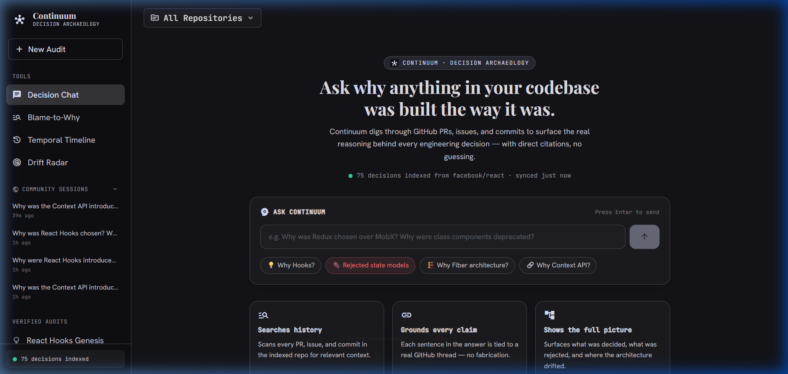
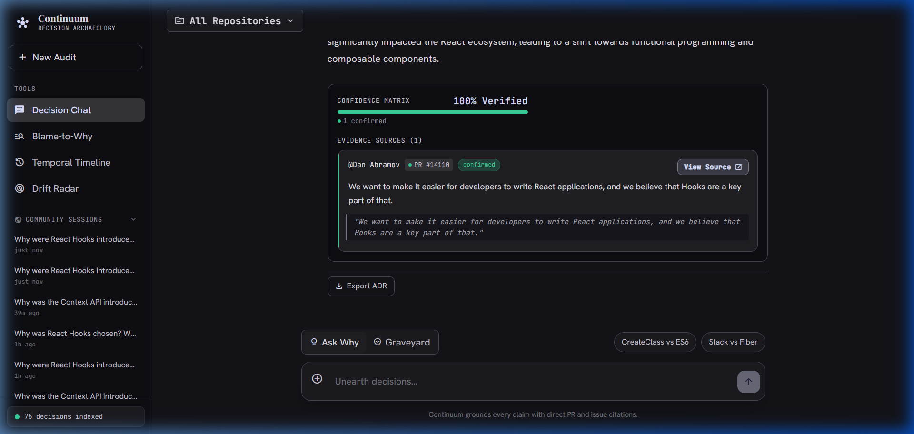
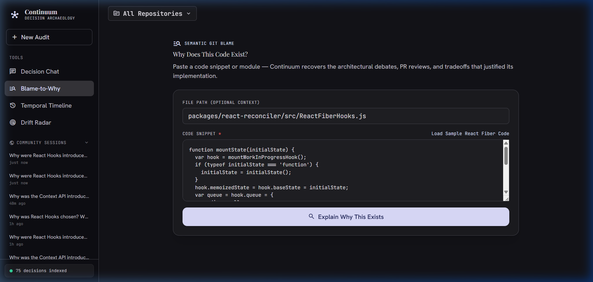
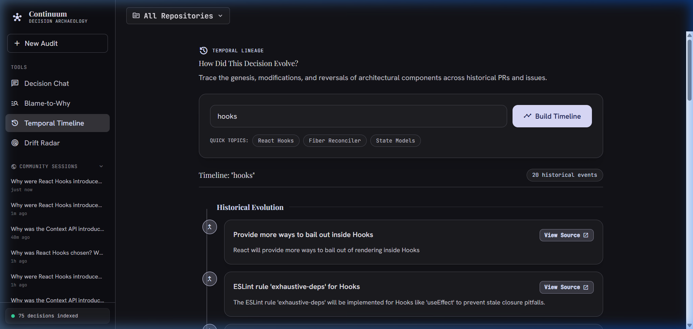
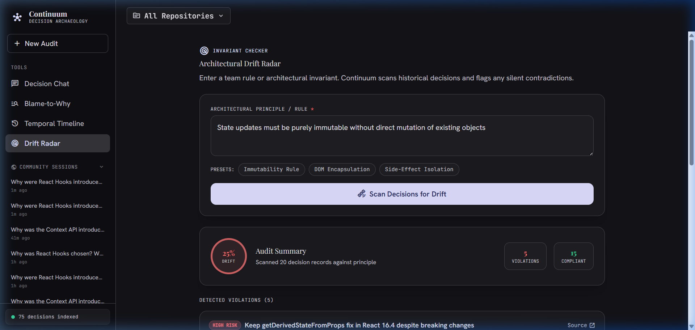

# Continuum — Decision Archaeology Agent

> Recovers the **WHY** behind engineering decisions from GitHub history.  
> Every answer is citation-grounded with direct PR, issue, and commit links. Zero hallucination.

[](https://continuumai.up.railway.app)
[](https://opensource.org/licenses/MIT)
[](https://fastapi.tiangolo.com)
[](https://modelcontextprotocol.io)
[](https://railway.com)
[](https://supabase.com)

---

## 📑 Table of Contents
- [🌐 Live Deployment](#-live-deployment)
- [📸 Visual Interface & Walkthrough](#-visual-interface--walkthrough)
- [💡 The Problem It Solves](#-the-problem-it-solves)
- [🌟 Key Features](#-key-features)
- [🧱 Tech Stack](#-tech-stack)
- [🏗️ System Architecture & Workflow](#️-system-architecture--workflow)
- [🚀 Quick Start (Local Setup)](#-quick-start-local-setup)
- [📡 REST API Reference](#-rest-api-reference)
- [🔌 IDE Integration (Model Context Protocol)](#-ide-integration-model-context-protocol)
- [🧗 Challenges & Architectural Solutions](#-challenges--architectural-solutions)
- [📚 What We Learned](#-what-we-learned)
- [🔮 What's Next & Roadmap](#-whats-next--roadmap)
- [📄 License](#-license)

---

## 🌐 Live Deployment

**→ [https://continuumai.up.railway.app](https://continuumai.up.railway.app)**

Continuum is live in production with 75 verified decision records indexed from `facebook/react`. No installation or configuration required — open the link and start investigating architectural decisions.

---

## 📸 Visual Interface & Walkthrough

<div align="center">
  
  <p><em>1. <strong>Hero & Archaeological Query Interface</strong> — Live decision index status, instant search, and verified benchmark presets.</em></p>
</div>

<br/>

<div align="center">
  
  <p><em>2. <strong>Forensic Dossier & Evidence Matrix</strong> — Structured archaeological strata (Context, Decision, Graveyard, Drift) with verifiable GitHub citations.</em></p>
</div>

<br/>

| 🔍 **Semantic Blame-to-Why** | ⏳ **Temporal Decision Lineage** |
|:---:|:---:|
|  |  |
| *Semantic git blame answering WHY code exists.* | *Chronological 20-event architecture evolution.* |

<br/>

<div align="center">
  
  <p><em>3. <strong>Architectural Drift Radar</strong> — Automated invariant scanner flagging silent violations against architectural rules.</em></p>
</div>

---

## 💡 The Problem It Solves

Engineering decisions accumulate critical context that lives nowhere in the codebase itself — buried in PR discussion threads, rejected RFCs, code review debates, and issue comments spanning years. When original authors leave or context is forgotten:
- Teams repeat past mistakes by proposing already-rejected architectures.
- Refactorings accidentally violate undocumented architectural invariants.
- Onboarding engineers spend weeks reconstructing tribal knowledge.

### Why existing approaches fall short:

- **"Why not just ask ChatGPT or Claude?"**  
  General-purpose LLMs only see the current code in front of them, not the repository's history. They guess *what* code does, but have zero awareness of the PR where an alternative was debated and rejected. They produce plausible-sounding answers with no factual grounding.
- **"Why not search GitHub commits/PRs manually?"**  
  Mid-sized repositories have thousands of PRs. Keyword search requires knowing exact past terminology, returns raw unranked lists, and forces engineers to manually read dozens of threads.
- **How Continuum is different:**  
  Continuum indexes the complete historical decision surface. It uses hybrid dense + sparse retrieval (RRF) to unearth the exact historical threads and synthesizes forensic answers where **every claim is linked directly to a verified GitHub PR, issue, or commit.**

---

## 🌟 Key Features

| # | Feature | Description | Route / Artifact |
|:---|:---|:---|:---|
| **1** | **Decision Chat** | Structured forensic dossier answers split into 4 archaeological strata: 🏛️ Context, 📜 Decision & Rationale, ⚰️ Graveyard, 🧬 Drift. | `POST /api/query` |
| **2** | **The Graveyard** | Dedicated search mode retrieving abandoned prototypes, discarded RFCs, and explicit rejection reasons. | `POST /api/graveyard` |
| **3** | **Blame-to-Why** | Semantic `git blame` that answers *why* a snippet exists, surfacing PR debates rather than just authors and timestamps. | `POST /api/blame` |
| **4** | **Temporal Timeline** | Chronological timeline tracking how architecture evolved across releases (Genesis → Modifications → Reversals). | `GET /api/timeline` |
| **5** | **Architectural Drift Radar** | Automated invariant checker comparing recent changes against historical principles to flag silent architectural drift. | `POST /api/drift-radar` |
| **6** | **Community Chat Persistence** | Global persistence backed by Supabase PostgreSQL — view, restore, and audit past investigations across the team. | `POST /api/sessions` |
| **7** | **Reverse ADR Generator** | One-click export of any decision inquiry into standardized [MADR (Markdown Architectural Decision Record)](https://adr.github.io/madr/) format. | `POST /api/export-adr` |
| **8** | **Déjà Vu Sentinel** | GitHub Action that runs on pull requests to detect and warn when someone proposes a historically rejected anti-pattern. | `POST /api/deja-vu` |
| **9** | **Native MCP Server** | Model Context Protocol server exposing 6 tools directly to Cursor, Claude Code, and Windsurf inside the developer's IDE. | `mcp_server.py` |
| **10** | **Citation Proof Cards** | High-contrast visual citation badges with verbatim source quotes, author attribution, and deep links. | Frontend Component |

---

## 🧱 Tech Stack

### Backend & AI Pipeline
- **API Framework:** FastAPI 0.115+ (Python 3.10+)
- **LLM Synthesis:** OpenRouter (`gemma-4-31b`, `nemotron-3` fallback chain)
- **Dense Vector Search:** Supabase `pgvector` (ivfflat cosine index)
- **Sparse Keyword Search:** Rank-BM25 (in-memory tokenized index for technical slang)
- **Hybrid Fusion:** Reciprocal Rank Fusion (RRF) combining dense & sparse ranks
- **Embeddings:** `sentence-transformers/all-MiniLM-L6-v2` (384 dimensions)
- **IDE Protocol:** Model Context Protocol (MCP SDK)

### Frontend
- **Framework:** React 18 + TypeScript
- **Bundler & Tooling:** Vite 6
- **Styling:** Tailwind CSS v4 with custom design tokens
- **Typography & Icons:** Inter, Space Mono, Material Symbols

### Infrastructure & Cloud
- **Database:** Supabase Managed PostgreSQL + `pgvector`
- **Application Hosting:** Railway (multi-stage Docker container)
- **CI/CD:** Git push-to-deploy pipeline

---

## 🏗️ System Architecture & Workflow

```
       ┌────────────────────────────────────────────────────────┐
       │             GitHub API (PRs, Issues, Commits)          │
       └───────────────────────────┬────────────────────────────┘
                                   │
                                   ▼
       ┌────────────────────────────────────────────────────────┐
       │   LLM Structured Extraction Pass (Signal vs. Noise)    │
       │   Decision · Rationale · Alternatives · Evidence Quotes│
       └───────────────────────────┬────────────────────────────┘
                                   │
            ┌──────────────────────┴──────────────────────┐
            ▼                                             ▼
┌──────────────────────────────┐              ┌──────────────────────────┐
│ Dense Embeddings (MiniLM-L6) │              │ Sparse BM25 Tokenization │
│   → Supabase pgvector Index  │              │   → In-Memory Index      │
└──────────────┬───────────────┘              └─────────────┬────────────┘
               │                                            │
               └──────────────────────┬─────────────────────┘
                                      ▼
             ┌─────────────────────────────────────────────────┐
             │       Reciprocal Rank Fusion (RRF Search)       │
             └────────────────────────┬────────────────────────┘
                                      ▼
             ┌─────────────────────────────────────────────────┐
             │    Grounded Synthesis + Confidence Matrix       │
             │   (Verified Citations · Forensic Dossier)       │
             └────────────────────────┬────────────────────────┘
                                      │
       ┌──────────────────────────────┼──────────────────────────────┐
       ▼                              ▼                              ▼
┌──────────────┐             ┌───────────────────┐        ┌──────────────────────┐
│  React 18 UI │             │ Native MCP Server │        │ GitHub PR Déjà Vu Bot│
│  Web App     │             │ (Cursor / Claude) │        │ (CI Action Sentinel) │
└──────────────┘             └───────────────────┘        └──────────────────────┘
```

---

## 🚀 Quick Start (Local Setup)

### 1. Clone & Environment Setup
```bash
git clone https://github.com/Monish-D609/continuum-decision-archaeology.git
cd continuum-decision-archaeology

python -m venv .venv
# Windows:
.venv\Scripts\activate
# macOS/Linux:
# source .venv/bin/activate

pip install -r requirements.txt
```

### 2. Configure Environment Variables
Copy `.env.example` to `.env` and provide your credentials:
```env
OPENROUTER_API_KEY=your_openrouter_api_key
SUPABASE_URL=https://your-project.supabase.co
SUPABASE_SERVICE_KEY=your_supabase_service_role_key
GITHUB_TOKEN=your_github_personal_access_token
```

### 3. Initialize Supabase Database
Execute the database setup schema in your Supabase SQL editor:
```bash
python -c "from continuum.vector_store import SETUP_SQL; print(SETUP_SQL)"
```
Then run the chat persistence migration in [`migrations/001_chat_history.sql`](./migrations/001_chat_history.sql).

### 4. Index a Repository
```bash
python scripts/01_ingest.py --repo facebook/react --max-prs 100
python scripts/02_extract.py --repo facebook/react
python scripts/03_embed_and_index.py --repo facebook/react
```

### 5. Launch Locally
```bash
# Start FastAPI backend (Terminal 1)
uvicorn api.main:app --reload --port 8000

# Start React frontend (Terminal 2)
cd frontend
npm install
npm run dev
```
Navigate to `http://localhost:5173` to explore the interface.

---

## 📡 REST API Reference

| Method | Endpoint | Description |
|---|---|---|
| `POST` | `/api/query` | Submit natural-language question → returns cited archaeological dossier |
| `POST` | `/api/graveyard` | Query specifically for rejected alternatives & anti-patterns |
| `POST` | `/api/blame` | Submit code snippet → returns historical PR context & rationale |
| `POST` | `/api/deja-vu` | Analyze PR title/diff against historical discarded approaches |
| `POST` | `/api/export-adr` | Export decision analysis as a standardized Markdown ADR file |
| `POST` | `/api/drift-radar` | Detect violations of documented architectural principles |
| `GET` | `/api/timeline` | Fetch chronological decision evolution for a topic |
| `GET` | `/api/health` | Health status and total indexed records count |
| `POST` | `/api/sessions` | Create a new persisted community chat session |
| `GET` | `/api/sessions` | List active sessions with timestamps and metadata |
| `GET` | `/api/sessions/{id}` | Retrieve complete message history for a session |
| `DELETE`| `/api/sessions/{id}` | Delete a session and its message logs |

---

## 🔌 IDE Integration (Model Context Protocol)

Continuum runs a native **MCP Server** (`mcp_server.py`) allowing AI assistants like **Cursor, Claude Code, and Windsurf** to query engineering memory directly while coding.

Add Continuum to your MCP configuration (`claude_desktop_config.json` or Cursor settings):
```json
{
  "mcpServers": {
    "continuum": {
      "command": "python",
      "args": ["/path/to/continuum/mcp_server.py"],
      "env": {
        "CONTINUUM_API_URL": "https://continuumai.up.railway.app"
      }
    }
  }
}
```

### Supported MCP Tools:
- `query_decisions(question, repo)` — Retrieve evidence-backed decision rationale
- `check_graveyard(question, repo)` — Inspect past rejected approaches before implementing
- `blame_to_why(code_snippet, file_path, repo)` — Reveal historical intent of code blocks
- `check_deja_vu(pr_title, pr_description, repo)` — PR sanity check against known anti-patterns
- `detect_drift(principle, repo, recent_n)` — Check code against architectural rules
- `get_decision_timeline(query, repo, top_k)` — Trace evolutionary history of a module

---

## 🧗 Challenges & Architectural Solutions

1. **Separating Decision Signal from Discussion Noise**
   - *Challenge:* GitHub PRs contain hundreds of comments regarding linting, formatting, and CI status that drown out architectural rationale.
   - *Solution:* Implemented an intermediate LLM extraction pass prior to vectorization that isolates structured units: Decision, Rationale, Rejected Alternatives, and Author Quotes.

2. **In-Memory BM25 Cold Starts on Server Reboots**
   - *Challenge:* Dense vector search is persisted in `pgvector`, but sparse BM25 is computed in-memory and required hydration from Supabase on startup.
   - *Solution:* Engineered eager background initialization during FastAPI lifespan hooks with graceful degradation to dense vector search if the index is hydrating.

3. **Hallucination Prevention & "Honest Gap" Reporting**
   - *Challenge:* Standard LLMs generate answers even when no repository evidence exists.
   - *Solution:* Configured strict JSON schema enforcement with an `is_insufficient_evidence` boolean flag and a Confidence Breakdown Matrix (*Confirmed*, *Inferred*, *Unknown Gap*).

4. **Citation Faithfulness vs. Narrative Coherence**
   - *Challenge:* Enforcing verbatim quotes within synthesized paragraphs created choppy text.
   - *Solution:* Separated narrative synthesis into an archaeological dossier while isolating verifiable citations into structured proof cards with direct URL links.

---

## 📚 What We Learned

- **Hybrid search is essential for developer corpora:** Pure semantic vector search struggles with commit hashes, function names, and technical slang. Merging BM25 with dense cosine similarity via Reciprocal Rank Fusion (RRF) dramatically improved precision.
- **Architectural history is non-linear:** Decisions are rarely static; they evolve through cycles of adoption, modification, and deprecation. Visualizing temporal strata gives developers far more confidence than a single static answer.
- **Developers want zero friction:** Exposing the pipeline through both a rich web UI and an IDE MCP server bridges the gap between deep forensic research and day-to-day coding workflows.

---

## 🔮 What's Next & Roadmap

- [ ] **Cross-Repository Knowledge Graphs:** Traverse interconnected dependency trees (e.g. tracing decisions between a framework and its plugin ecosystem).
- [ ] **Automated GitHub PR Bot Deployment:** One-click GitHub App integration to comment on PRs with historical warnings automatically.
- [ ] **Slack & Discord Integrations:** Interactive bots that answer architectural inquiries directly in team channels.
- [ ] **Self-Hosted Local Vector Stores:** Embedded SQLite + DuckDB fallback for air-gapped internal enterprise repositories.

---

## 📄 License

Distributed under the MIT License. See [LICENSE](https://opensource.org/licenses/MIT) for more information.
